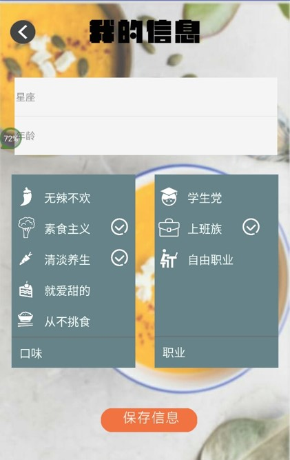
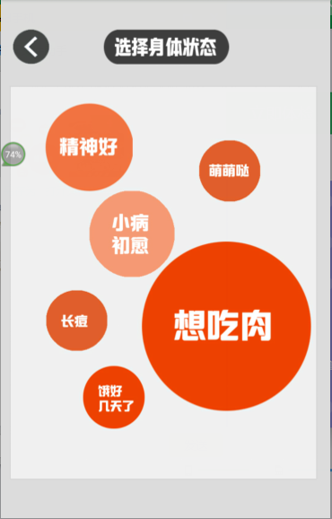

## 项目简介
    
《吃啥》：一款针对于有饮食选择困难的用户而定制的App。        

 主要功能：     

       > 1 在'自定义'模块： 用户可以根据自身情况特点快速生成适合自己的饮食选择；          
       
       > 2 在'随机推荐'模块： 用户可以使用此模块进行快速推荐;             
       
       > 3 在'请客模式'模块：  用户可以在多种选择中随机快速抽取饮食选项。     
       
       > 4 注册登录后保存个人信息并依次进行随机推荐          
       
       > 5 用户登录后可以点赞自己喜欢的食物       
       
app 部分截图                 

  
## 源码说明

    本项目基于weex0.6.3 版本实现。 跳转这里参见[后端代码](https://github.com/LuoYuWuSheng/What2Eat)
    
### master

    master分支为编写运行代码版本可直接运行热部署. 代码初始化是使用 weex-toolkit 工具
    
### dev

    dev 分支是可打包成apk 的版本，代码初始化是使用 weex-pack 工具

  > 注意点： 在项目中图片均为在线图片可能存在过期不能访问的情况，所有图片见 imgs文件夹

## 运行程序

### master 分支
  
  > npm install -g weex-toolkit    # 应先安装 node-gyp     
  
  > npm run build                  # 编译`src/main.we` 到 `dist/main.js`     
  
  > npm run dev                    # 将 `src/main.we`中的改变自动编译到 `dist/main.js` 
  
  > npm run serve                  # 启动服务器 可以在 `http://localhost:8080/`进行h5 预览             

### dev 分支

  > npm install -g weex-pack       # 安装weex-pack 工具         
  
  > npm run android                # apk 打包
 

